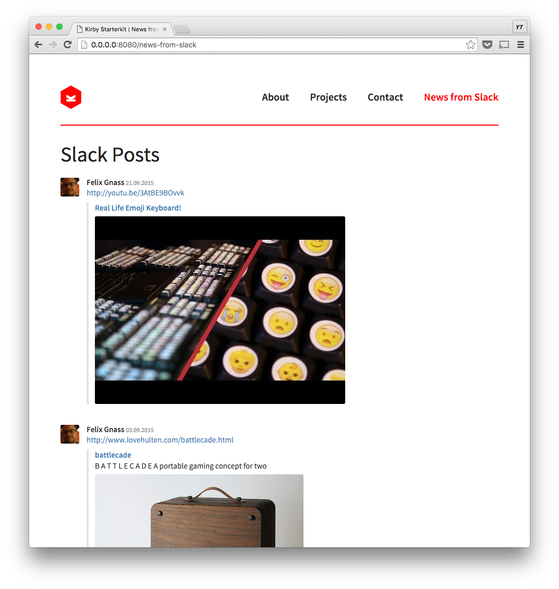
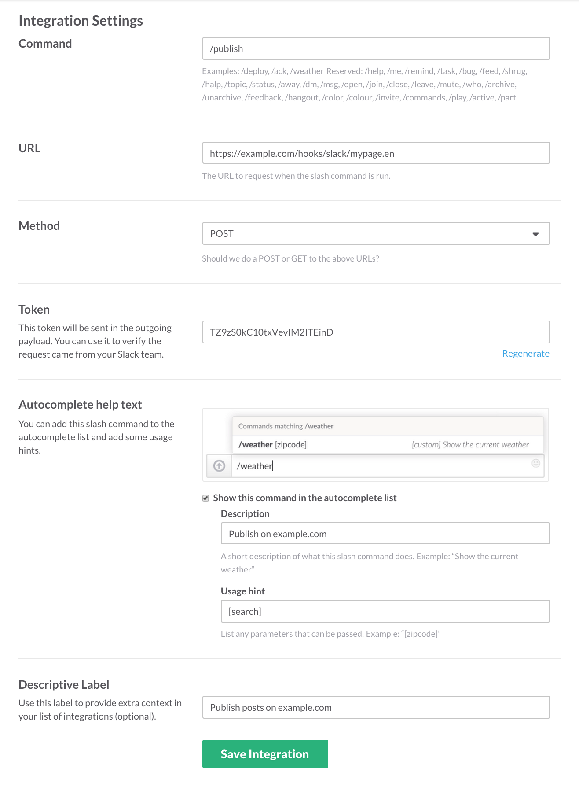

# Kirby plugin to /publish Slack posts on the web

This plugin lets Slack users publish posts from any (non-private) Slack channel to a Kirby website.



## Installation

Download the plugin from GitHub and put its contents into `site/plugins/slack`.

Or add it as Git submodule:

    git submodule add https://github.com/yours-truly/kirby-slack.git site/plugins/slack

## Local quickstart

Start your kirby server:

    php -S 0.0.0.0:8080

In a second terminal [set up a tunnel](https://ngrok.com/) to expose your local server:

    ngrok 8080


## Configuration

Goto to your team's Slack integrations page and set choose __Slash Commands__ from the _DIY Integrations & Customizations_ section.

Set up the integration like this:



The __URL__ field must point to your website and include the name
(and optionally the language) of the page where the posts should be
stored. The format is:

`http(s)://<domain>.<tld>/hooks/slack/<page-name>[.lang]`

Copy the generated __Token__ and add it to you `site/config/config.php`:

```php
c::set('slack.verify', '<insert your verification token here>');
c::set('slack.auth', '<insert your auth token here>');
```

The `slack.auth` token can be obtained by visiting https://api.slack.com/web

With this _full-access token_ the plugin will query the Slack Web API to retrieve the actual post and its attachments.

## How it works

The plugin (when set up as Slack command integration) will look for the last post that contains the given _keyword_ and download the first attached image or video thumbnail.

__Note:__ If the post doesn't have any media attached, the Slackbot will refuse to publish it.

Along side the downloaded image a `.txt` will be stored that contains the
following information:

* `Date` – The post's formatted date (DD.MM.YYYY)
* `Linkurl` – The external link
* `Title` – The attachment's title
* `Description` – The meta description of the linked page
* `Author` – The real name of the user who created the post
* `Avatar` – The name of the author's avatar image (`<user-id>.jpg`)
* `Comment` – The posts text (containing the link) converted into HTML
* `Slack` – A marker that is always set to `1` and can be used to identify Slack posts

## Displaying posts

To display posts on your website copy [snippets/slack.php](snippets/slack.php) to your `site/snippets` folder and customize it as needed.

To add some basic styling that mimics Slacks's internal layout add the rules from [assets/slack.css](assets/slack.css) to your stylesheet.

## Editing posts

In order to edit posts via the Kirby panel you can add the following file-fields to the blueprint of your page:

```yaml
files:
  fields:
    title:
      label: Title
      type: text
    slack:
      type: hidden
    description:
      label: Description
      type: textarea
    link:
      label: Linkurl
      type: url
    author:
      label: Author
      type: text
    avatar:
      type: hidden
    Comment:
      label: Comment
      type: textarea
```

## Ideas

For now the plugin perfectly fits our needs. There are some additional ideas though that might get implemented in the future. These are:

* Restrict `/publish` to certain users
* Add an option so that people can only publish their own posts
* Add an `/unpublish` command
* Also search the attachment's text/title/link for the given _keyword_, not only the post text entered by the user.

## License

MIT
